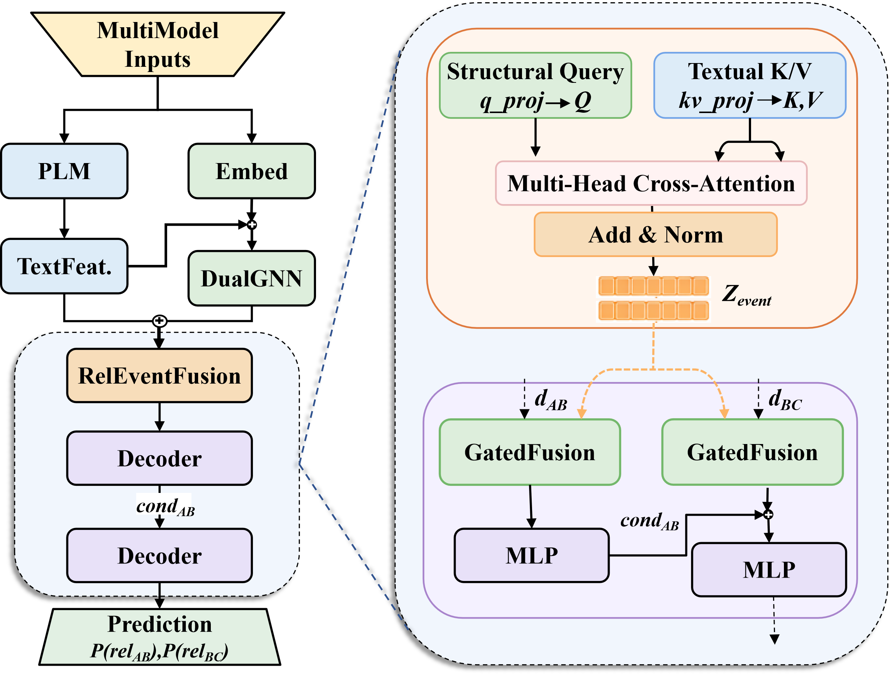

# SLC-TAHG: Benchmarking LLM Structural Reasoning on Text-Attributed Hyper-Relational Cascades

SLC-TAHG is an evidence-traceable benchmark for evaluating **few-shot, event-conditioned cascade reasoning** over text-attributed hyper-relational graphs.

Instead of predicting isolated links, the benchmark asks whether a model can recover an entire biomedical cascade under a shared event context:

```text
SLCGene --relAB--> Pathway --relBC--> Disease
```

Both `relAB` and `relBC` are classified as `promotion` or `suppression`. A path is correct only when both stages are predicted correctly for the same RelaEvent.

<p align="center">
  
</p>

## Highlights

- **Event-centric representation:** a `RelaEvent` binds an SLC gene, pathway, disease, two relation labels, contextual attributes, and relation-aligned evidence.
- **Traceable biomedical evidence:** each target relation is linked to sentence-level PubMed evidence rather than generated supervision.
- **Path-level evaluation:** the benchmark separates local edge correctness from jointly correct cascade recovery.
- **Unified model comparison:** relational GNNs, hyper-relational models, tensor factorization, text-only encoders, prompted LLMs, and graph-augmented LMs are evaluated under controlled candidate labels and evidence access.
- **CaRe:** a structure-aware cascade model that explicitly represents the shared event and the ordered `AB -> BC` dependency.


## Dataset Statistics

| Item | Count / Description |
| --- | --- |
| Nodes | 2,777 |
| Edges | 4,473 |
| Node types | 8 |
| Event-conditioned paths | 875 |
| Core cascade | SLCGene -> Pathway -> Disease |
| Relation labels | promotion / suppression |
| Text attributes | Relation-aligned, sentence-level evidence |
| Primary task | Two-stage constrained relation classification |
| Evaluation settings | Full-data, attribute ablation, and few-shot learning |

## Metrics

- **AB Accuracy / Macro-F1:** upstream `SLCGene -> Pathway` prediction.
- **BC Accuracy / Macro-F1:** downstream `Pathway -> Disease` prediction.
- **Path Accuracy:** fraction of paths for which both AB and BC are correct; this is the primary metric.
- **Path F1:** F1 of the jointly correct `TT` class under the released four-way path-error encoding (`TT`, `TF`, `FT`, `FF`).

An unparseable generative output is counted as `FF` for path-level evaluation.

## CaRe

CaRe is a structure-aware cascade model designed to address the gap between local relation prediction and complete-path reliability. It contains three main components:

1. **Stage-specific structural encoding:** independent AB and BC graph streams preserve the distinct roles of the two relations.
2. **Relation-aligned text injection:** AB and BC evidence are encoded separately and injected into their event representations through gated residual updates.
3. **Conditional two-stage decoding:** the BC decoder conditions on the predicted AB relation and the shared event representation.

<p align="center">
  
</p>

## Download

Download the dataset and related files from Science Data Bank:

[https://www.scidb.cn/en/detail?dataSetId=d2461f91de8c49e5b545241119d41f1c](https://www.scidb.cn/en/detail?dataSetId=d2461f91de8c49e5b545241119d41f1c)

Place the downloaded files in their corresponding repository directories before running the code.

## Installation

```bash
git clone https://github.com/kg4sci/SLC-TAHG.git
cd SLC-TAHG
```

Different baseline families use separate environments because of dependency conflicts.

### Graph and Tensor Baselines

```bash
conda create -n slctahg python=3.10
conda activate slctahg
pip install -r requirements.txt
```

### GraphGPT

```bash
conda create -n graphgpt python=3.9
conda activate graphgpt
pip install -r requirements_graphgpt.txt
```

### TAPE

```bash
conda create -n tape python=3.8
conda activate tape
pip install -r requirements_tape.txt
```

## Data Configuration

Download and import the released Neo4j data before running graph-based experiments. MongoDB metadata is optional because the processed text used by the evaluation code is already available under `Eval_module/data`.

Configure local database access where required:

```python
NEO4J_URI = "bolt://localhost:7687"
NEO4J_USER = "neo4j"
NEO4J_PASSWORD = "your-password"

MONGO_URI = "mongodb://localhost:27017"  # optional
```

Do not commit credentials to the repository. Environment variables or an ignored local configuration file are recommended.

## Running the Released Baselines

### Graph and Tensor Models

```bash
# GRAN
python -m Eval_module.GRAN.GRAN

# RGCN
python -m Eval_module.RGCN.RGCN

# N-ComplEx
python -m Eval_module.NComplEx.NComplEx
```

Other structural baselines can be run from their corresponding directories under `Eval_module/`.

### GraphGPT

```bash
cd Eval_module
bash graphgpt/gr/run_stage1.sh
bash graphgpt/gr/train_gran_stage2.sh
bash graphgpt/gr/eval_gran.sh
```

Cascade evaluation:

```bash
python -m graphgpt.gr.eval_gran_cascading \
  --model_output_file ./graphgpt/gr/graphgpt/eval/arxiv_test_res_all.json \
  --save_path ./graphgpt/gr/graphgpt/eval/arxiv_test_res_all_metrics.json
```

### TAPE

```bash
cd Eval_module
bash tape/models/run.sh
```

## Hyperparameter Search

Graph-based baselines use Optuna with up to 200 trials. Selected configurations are stored in `Best_modelPara/`.

```bash
python optuna_hyperparameter_tuning.py --model GRAN --n_trials 200
```

Hyperparameter selection must be performed without accessing the corresponding test fold.

## Repository Scope

The current public repository contains the SLC-TAHG dataset interface, benchmark protocol, evaluation code, and released baseline implementations. The latest manuscript also reports CaRe and cross-domain experiments on ElectroCat-KG and WD50K; add the corresponding training commands here when those implementations and processed datasets are released rather than documenting unverified paths.

For the detailed benchmark contract, see [`BENCHMARK_USAGE_PROTOCOL.md`](BENCHMARK_USAGE_PROTOCOL.md).

## License

The code in this repository is released under the [MIT License](LICENSE). Dataset users should also follow the terms specified on the Science Data Bank download page and the applicable terms of the original biomedical sources.
